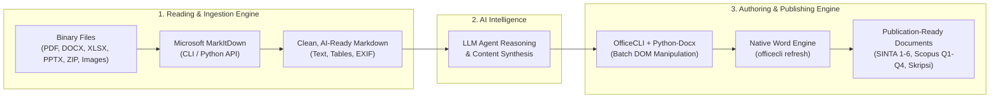

<div align="center">

# 📄 Unified Office & Document Suite for AI Agents

**The definitive document intelligence and authoring skill for AI coding assistants.**  
*Fast multi-format extraction to Markdown via Microsoft MarkItDown + programmatic OpenXML authoring via OfficeCLI.*

[](https://opensource.org/licenses/MIT)
[](http://makeapullrequest.com)
[]()
[](https://www.python.org/)
[]()
[]()

---

</div>

## 📌 Overview & Philosophy

In modern AI agent workflows, working with binary documents (Word `.docx`, Excel `.xlsx`, PowerPoint `.pptx`, and `.pdf`) often suffers from a painful dichotomy:
1. **Raw text readers fail** on complex tables, multi-column layouts, and images.
2. **Naive markdown converters lose visual fidelity**, strip academic numbering, flatten table structures, or leak unrendered LaTeX tags into Microsoft Word.

**Unified Office Suite** solves this by enforcing a strict **two-engine pipeline**:



* **Read Fast & Deep:** [Microsoft MarkItDown](https://github.com/microsoft/markitdown) parses complex binary files into structured Markdown for agent consumption.
* **Write With Zero Flaws:** [OfficeCLI](https://officecli.ai) creates and edits native OpenXML documents with perfect typography, APA tables, dynamic TOC, and guaranteed page layouts.

---

## 🚀 Installation & Pre-Flight Check

### 1. Install This Skill (Public Agents)
Clone this repository directly into your AI assistant's skills directory:

```bash
# Global Gemini / Antigravity Skill Root
git clone https://github.com/<OWNER>/<REPO>.git ~/.gemini/config/skills/office-cli

# Or for project-specific workspace (.agents/skills)
git clone https://github.com/<OWNER>/<REPO>.git .agents/skills/office-cli
```

### 2. Automatic Monthly Updates for Public Users
To ensure all public users always receive the latest OJS SINTA templates, Scopus guidelines, and OfficeCLI batch recipes:
* **Built-in 30-Day Check:** The AI agent checks the repository freshness every **30 days** automatically when handling documents and pulls the latest changes.
* **Manual On-Demand Sync:** You can ask your agent (*"perbarui skill office-cli"*) or run:
  ```powershell
  python scripts/check_update.py --force
  ```

---

### 3. Required CLI Engines

Before executing document operations, verify that the required CLI engines are installed:

#### A. Microsoft MarkItDown (Reading Engine)
- **Repository:** [https://github.com/microsoft/markitdown](https://github.com/microsoft/markitdown)
- **Verify Installation:**
  ```powershell
  # Check direct command or python module
  markitdown --version
  python -m markitdown --version
  ```
- **Install Command:**
  ```bash
  pip install markitdown
  # For optional plugins (Speech-to-Text & Image OCR):
  pip install markitdown[all]
  ```

#### B. OfficeCLI (Authoring & Manipulation Engine)
- **Official Site / Repository:** [https://officecli.ai](https://officecli.ai) / [https://github.com/officecli](https://github.com/officecli)
- **Verify Installation:**
  ```powershell
  officecli --version
  ```
- **Install Command:**
  - **Windows (PowerShell):**
    ```powershell
    irm https://d.officecli.ai/install.ps1 | iex
    ```
  - **Linux / macOS (Bash):**
    ```bash
    curl -fsSL https://d.officecli.ai/install.sh | bash
    ```

---

## 🛠️ Usage Quickstart

### A. Extract Any Document to Markdown (MarkItDown)
Never inspect raw binary files directly. Extract them cleanly first:
```powershell
# Extract PDF, DOCX, XLSX, or PPTX
python -m markitdown "report.pdf" > "scratch/extracted.md"
python -m markitdown "data_sheet.xlsx" > "scratch/data.md"
```

### B. Programmatic Office Document Manipulation (OfficeCLI)
Inspect the Document Object Model (DOM) and apply atomic JSON patches:

```powershell
# 1. Inspect DOM structure
officecli info "manuscript.docx"
officecli get "manuscript.docx" --path "body/p[0]"

# 2. Apply batch mutations (atomic add, set, remove)
officecli batch "manuscript.docx" --batch "batch.json"

# 3. Recalculate TOC, field codes & close lock
officecli refresh "manuscript.docx"
officecli close "manuscript.docx"
```

---

## 🎓 Academic Publishing Standards (Built-in Support)

This suite comes pre-loaded with comprehensive guidelines and templates for academic publishing:

### 1. Jurnal Nasional Terakreditasi SINTA (SINTA 1–6)
* **Structure:** IMRaD without chapter titles (`1. PENDAHULUAN`, `2. METODE`, `3. HASIL DAN PEMBAHASAN`, `4. KESIMPULAN`).
* **Page 1 Abstract Fit:** Bilingual abstracts (ID & EN) + Title + Authors + Affiliations + Email are strictly fitted within **Page 1** (9.5 pt TNR, 1.0x spacing, 150–200 words).
* **Continuous Flow:** Sections flow continuously without artificial page breaks.
* **APA Tables:** 3 horizontal lines only, no vertical column borders.
* **Guide:** [`references/pedoman_jurnal_sinta.md`](references/pedoman_jurnal_sinta.md)
* **Master Template:** [`templates/template_jurnal_sinta.docx`](templates/template_jurnal_sinta.docx)

### 2. International Reputable Journals (Scopus Q1–Q4)
* **Extended IMRaD:** Dedicated *Related Work* comparison matrix, reproducible algorithm boxes, and *Ablation Studies*.
* **100% Academic English:** Formal tone with rigor.
* **Ethical Declarations:** *Data Availability Statement*, *Code Availability*, *Conflict of Interest*, and *CRediT Author Taxonomy*.
* **Author Identification:** Mandatory ORCID iDs for all co-authors.
* **Upgrading Pathway:** Detailed guide on upgrading a SINTA 2 manuscript into a Scopus Q2/Q3 submission.
* **Guide:** [`references/pedoman_jurnal_scopus.md`](references/pedoman_jurnal_scopus.md)

### 3. Thesis & Skripsi Standar Nasional Indonesia
* **Margin Standard:** 4-4-3-3 cm (Left 4 cm for binding, Top 4 cm, Bottom 3 cm, Right 3 cm).
* **Chapter Structure:** Explicit chapter headings (`BAB I PENDAHULUAN`, `BAB II TINJAUAN PUSTAKA`...) with mandatory **Page Breaks** per chapter.
* **Typography:** Times New Roman 12 pt, 1.5x line spacing, 1.27 cm paragraph indentation.
* **Guide:** [`references/pedoman_skripsi_lengkap.md`](references/pedoman_skripsi_lengkap.md)

---

## 🛡️ Production Lessons Learned (Zero-Defect Rules)

This skill encapsulates critical battle-tested rules from real-world AI coding failures:

| Anti-Pattern | Fatal Consequence | Enforced Solution |
| :--- | :--- | :--- |
| **LaTeX in Word (`$x$`, `\Delta`)** | Dollar signs and raw code printed verbatim in Word. | **Unicode Math Conversion:** All math converted to native Unicode (`κ`, `Δ`, `×`, `≈`). |
| **Forward Index Removal** | `r[2]` removed, shifting `r[3]` to `r[2]`, throwing `Path not found`. | **Reverse Removal:** Batch operations must delete child nodes from **highest index to lowest** (`r[4]` $\rightarrow$ `r[3]` $\rightarrow$ `r[2]`). |
| **PowerShell stdout Piping** | Non-UTF8 Windows codepage corrupts quotes and em-dashes (`ÔÇ£`). | **Python Subprocess:** Execute batch operations via Python subprocess with explicit `encoding="utf-8"`. |
| **Zombie WINWORD Process** | `PermissionError: [Errno 13]` when overwriting files. | **Headless Process Purge:** Detect and terminate background headless Word processes holding file handles. |
| **Workspace Pollution** | Scratch scripts and dump files cluttering user repo. | **Artifact Scratch Directory:** All intermediate scripts and batch JSONs must reside exclusively in temporary artifact scratch folders. |
| **Hardcoded Personal Data** | Privacy leak when publishing skill to GitHub. | **Dynamic Context Ingestion:** Never hardcode personal names or emails; derive dynamically from active project context. |

---

## 📁 Repository Structure

```text
office-cli/
├── SKILL.md                                 # Core agent instructions & operational rules
├── README.md                                # Public documentation (You are here)
├── scripts/
│   └── check_update.py                      # 30-day automated GitHub sync script
├── templates/
│   └── template_jurnal_sinta.docx           # Master universal SINTA OJS template (DOCX)
└── references/
    ├── pedoman_jurnal_sinta.md              # SINTA 1-6 comprehensive publication guide
    ├── pedoman_jurnal_scopus.md             # Scopus Q1-Q4 international journal guide
    ├── pedoman_skripsi_lengkap.md           # Indonesian standard thesis & skripsi guide
    ├── resep_officecli_dokumen_ilmiah.md    # Ready-to-use OfficeCLI batch recipes
    └── aturan_adaptif_pedoman_kampus.md     # Campus-specific guideline overrides
```

---

## 🤝 Contributing

Contributions to improve formatting recipes, add new journal templates (IEEE, Springer, ACM, Elsevier), or expand MarkItDown extractors are warmly welcomed!
1. Fork the repository.
2. Create your feature branch (`git checkout -b feature/NewTemplate`).
3. Commit your changes (`git commit -m 'Add IEEE conference docx template'`).
4. Push to the branch (`git push origin feature/NewTemplate`).
5. Open a Pull Request.

---

## 📄 License

This skill is open-sourced under the [MIT License](LICENSE).
Feel free to use, adapt, and integrate it into your AI workflows.
